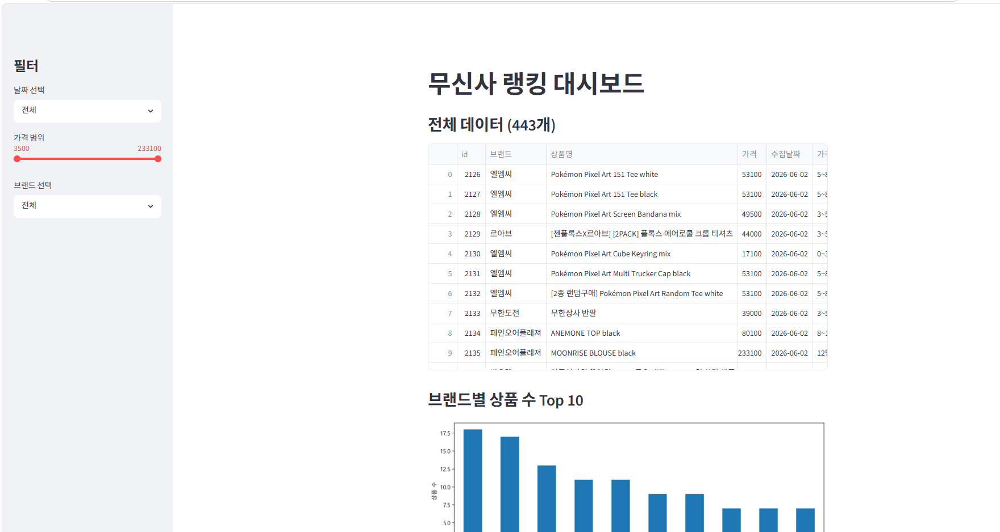

# 무신사 랭킹 페이지 분석 및 브랜드 전략 수립

## 프로젝트 소개
매일 무신사 랭킹 페이지의 약 1위부터 1000위까지의 상품 데이터를 통해 
현재, 향후 패션 트렌드를 분석하여 브랜드의 판매 전략을 제시합니다. 

## 주요 기능
- 크롤링 및 스케쥴러를 이용하여 매일 무신사 랭킹 페이지 약 1000개의 데이터를 분석
- 일반인분들도 한 눈에 이해가능하도록 Streamlit을 통한 깔끔한 대시보드 제공
- 패션 분야 전문 데이터 분석가와 버티컬 AI(GROQ)가 함께 데이터 분석하여 단기, 장기적인 브랜드 전략 수립

## 기술 스택
- Python, Selenium, Streamlit, SQLite, Groq AI, schedule, pandas

## 데모
[라이브 대시보드 보기](https://musinsa-exercise-hongsiik.streamlit.app)

## 연락처
- 이메일: thd8219@gmail.com 
- 크몽: thd8219